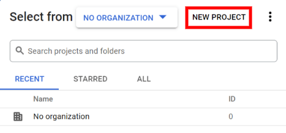
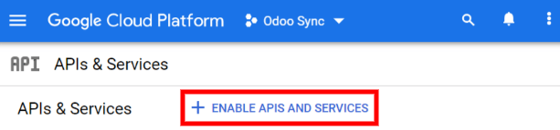
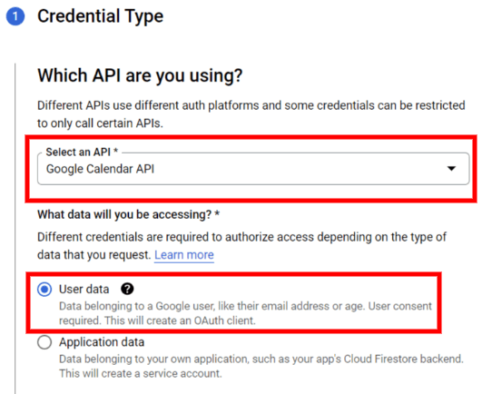
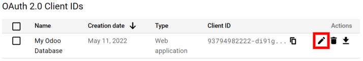
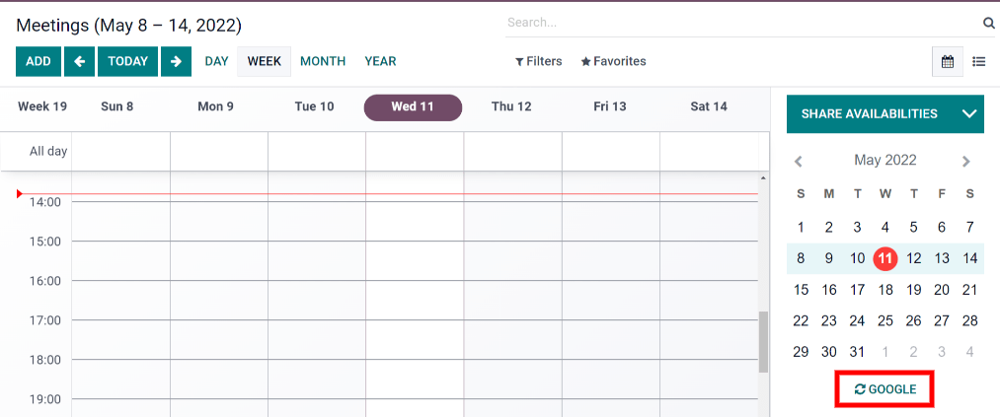
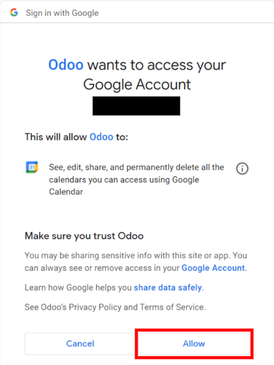
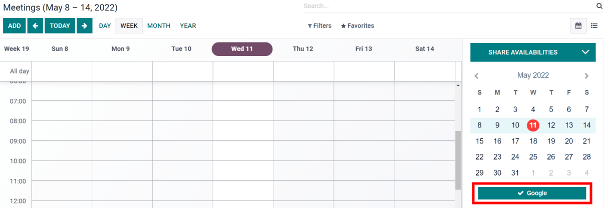

=====================================
Synchronize Google Calendar with Odoo
=====================================

Synchronize Google Calendar with Odoo to see and manage meetings from both platforms (updates go 
in both directions). This integration helps organize your schedule so you never miss a meeting.

Setup in Google
===============

Enable Google Calendar API
--------------------------

- Go to the `Google API Console <https://console.developers.google.com>`_ and log into your Google 
  account.

.. note::
   If this is your first time visiting this page, Google will prompt you to enter your 
   :guilabel:`Country` and agree to the Terms of Service. Select your country from the drop-down 
   list and agree to the :abbr:`ToS (Terms of Service)`.
  
- Click :guilabel:`Select a project` and select or create an API project to store credentials.

.. tip::
   Give the API Project a clear name like "Odoo Sync" so you can easily find it.

- Open the API Project and click :guilabel:`Enable APIs and Services`.

- Search for **Google Calendar API** using the search bar and select **Google Calendar API** from 
  the search results. Click :guilabel:`Enable`.

.. image:: google_calendar_credentials/enable_google_cal_api.png
   :align: center
   :alt: Enable the Google Calendar API.

Create credentials
------------------

- Click :guilabel:`Create Credentials`.

- In the first step, **Credential Type**, select the *Google Calendar API* and *User Data* 
  options. Then, click :guilabel:`Next`.

- In the **OAuth Consent Screen** step, type *Odoo* in the :guilabel:`App name` field, select 
  your email address for the :guilabel:`User support email` field, and type your email address for 
  the :guilabel:`Developer contact information` section. Click :guilabel:`Save and Continue`.

- Skip the **Scopes** step by clicking :guilabel:`Save and Continue`.

- In the **OAuth Client ID** step, select *Website application* for the 
  :guilabel:`Application Type` field and type *My Odoo Database* for the :guilabel:`Name`. In the 
  **Authorized JavaScript Origins** section, click :guilabel:`+ Add URI` and type your company's 
  Odoo URL address. In the **Authorized redirect URIs** section, click :guilabel:`+ Add URI` and 
  type your company's Odoo URL address followed by */google_account/authentication*. Finally, 
  click :guilabel:`Create` and :guilabel:`Done`.

.. image:: google_calendar_credentials/uri.png
   :align: center
   :alt: Add the authorized JavaScript origins and the authorized redirect URIs.

Client ID & Client Secret
-------------------------

- Open the Google Cloud Platform navigation menu and go to 
  :menuselection:`API & Services --> Credentials`.

- In the **OAuth 2.0 Client IDs** section, locate the credentials you just created for the Google 
  Calendar API. Click on :guilabel:`Edit OAuth Client` (the pencil icon).

- Locate the Client ID and the Client Secret. Both of these are needed to connect Google Calendar 
  to Odoo.

Setup in Odoo
=============

- Open the Odoo database and go to the 
  :menuselection:`Settings --> General Settings --> Integrations --> Google Calendar`. Check the 
  box next to :guilabel:`Google Calendar`.

.. image:: google_calendar_credentials/settings_google_cal.png
   :align: center
   :alt: The Google Calendar checkbox in General Settings.

- Copy and paste the Client ID and the Client Secret from the Google Calender API Credentials 
  page into their respective fields below the :guilabel:`Google Calendar` checkbox. Then, click 
  :guilabel:`Save`.

- Go back to the main database menu in Odoo and open the :guilabel:`Calendar` module.
- Click on the :guilabel:`Google` sync button to sync Google Calendar with Odoo.

.. note::
   The first time you sync your Google Calendar with Odoo, the page will redirect to your Google 
   Account. Click :guilabel:`OK` and :guilabel:`Allow` to authorize Odoo to access Google Calendar.

Now, Odoo Calendar is successfully synced with Google Calendar!

